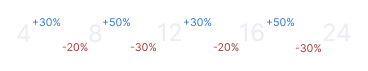
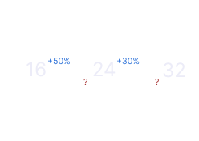
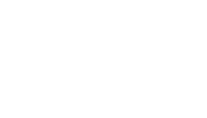
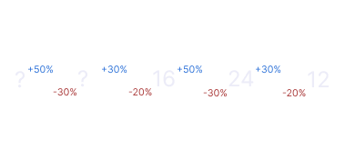

# What is this?

Stop thinking about how much far should element A be from element B. Spacify is a spacing and sizing system. It generates values that you can just copy and paste to your design.

# How are the values generated?

## Inspiration

This project takes inspiration from _Refactoring UI_, a book written by Adam Wathan and Steve Schoger. It is under "Establish a spacing and sizing" - "Defining the system"

The book has this example, and I've noticed that values are generated by some factor.

## Calculation

The way this works is we generate a multiplier from a factor, then we multiply it by a base value.

| Value | Base | Multiplier |
| :---- | ---- | :--------- |
| 12    | 16   | 0.75       |
| 16    | 16   | 1          |
| 24    | 16   | 1.5        |

Values generated from multiplier 1 is easy, we just increase the current value by the factor.

Example:
Factor is: 30 - 50 (3:5)

16 plus its 50% = 24
24 plus its 30% = 32
32 plus its 50% = 48

Yes, it is alternating ([see why](https://github.com/dotRarufu/spacify?tab=readme-ov-file#but-why-are-there-two-values "SPOILER: I don't know why"))

Now we solve for values generated under multiplier 1

Let's define some variables first,

To get values under multiplier 1, we need to know F1' and F2'

Here is the formula, its simple, you too can come up with this formula if you understand percentage

It's simple once we know F1' and F2', we just have to subtract x percentage from the base

## How are the factors generated?

The book mentioned that a difference between two values only make a perceivable change when increased by about 25%

This means that the factor should be

F1 > 25

F2 - F1 > 25

### But why are there two values?

I also don't know why. But the book's example suggest that there should be two values.

# Motivation

Personally, I don't want to bring up my calculator every time I create a project's spacing and sizing system. This is more of a personal tool, but I made it because maybe you don't want that experience as well.
